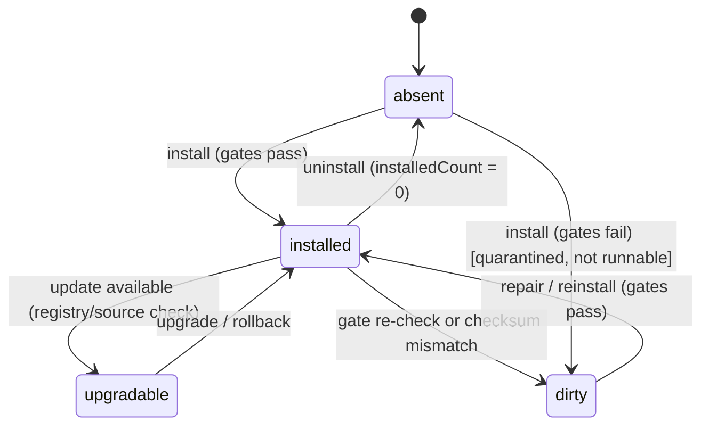

# Agent-First Plugin Lifecycle — Design

| Metadata | Value |
|---|---|
| Document version | 1.0.0-draft |
| Date | 2026-09-06 |
| Status | Design converging |
| Owner | Assayer Maintainers |

## 1. Purpose

This document is the semantic source for the plugin installation lifecycle as
experienced through the **Agent-first plugin workbench (M5)**. It defines:

1. the three-layer UX model (natural-language intent -> plan/confirm -> deterministic execution);
2. the plugin lifecycle **state machine** and its states;
3. every lifecycle operation, its success landing, and its **fail-closed** boundary conditions;
4. the installation store model and the trust gates every mutation must pass;
5. the CLI surface (one NL entry + a deterministic substrate) and the M5 exit gate.

It does **not** change the platform kernel's domain neutrality: validation never
imports plugin code, lifecycle modules remain injectable, and all operations fail
closed with stable error codes. The existing library API
(`assayer_platform.plugin_lifecycle.PluginLifecycleManager` and
`PluginInstallationStore`) is the deterministic substrate this design builds on;
M5 adds the NL intent layer and closes the gaps below (dirty isolation,
downgrade semantics, full CLI surface).

## 2. Three-layer model

The user only ever faces layer 1. Layers 2 and 3 exist so that conversation is
not the only trust mechanism.

```mermaid
flowchart TD
    A[User natural-language intent] --> B[Intent resolution: agent]
    B --> C[Deterministic plan: operations + trust-gate results]
    C --> D{Dangerous mutation?}
    D -- yes --> E[Print plan + gate report, wait for confirmation]
    D -- no --> F[Execute deterministically]
    E -- confirm / --yes --> F
    E -- deny --> G[Abort, no state change]
    F --> H[Lifecycle manager + installation store]
```

| Layer | Who sees it | Responsibility |
|---|---|---|
| 1. Intent | User | One conversational entry: `assayer "…"`. No verbs, no flags, no raw `--scope-json`. |
| 2. Plan/confirm | User as audit trail | NL intent resolves into a deterministic operation list. Dangerous operations (install/upgrade/downgrade/rollback/uninstall) default to stop-and-confirm; `--yes` skips. The user confirms the *plan*, not a command. |
| 3. Execution | Machine | The existing fail-closed `PluginLifecycleManager` + `PluginInstallationStore`. Same code path regardless of whether the request arrived via NL or a script. |

Invariant: **any NL intent must resolve to a layer-3 operation sequence; if it
cannot, the agent asks a clarifying question rather than guessing.** Re-running
the same intent is deterministic, or explains its differences.

## 3. Lifecycle state machine



| State | Meaning | Runnable? |
|---|---|---|
| `absent` | No record and no package in the store. | no |
| `installed` | An active version exists and its last gate/checksum check passed. | yes |
| `upgradable` | `installed` plus a newer version is known to exist. | yes (current version) |
| `dirty` | The package failed a trust gate, failed a checksum check, or was partially materialized. Quarantined: visible but not runnable. | no |

`dirty` is the key addition over the current implementation. A bad plugin must
be **visible but not runnable** — `info` explains why, `run` refuses — instead of
silently failing at import time.

## 4. Operations, boundaries, and failure states

Every mutation is idempotent: a repeated request has a defined outcome and never
leaves the store half-written. "Fail closed" means the error is reported and the
store is left unchanged.

| Operation | NL example | Success landing | Failure states (fail-closed) |
|---|---|---|---|
| install | "install spec-quality" | absent -> installed | already installed (idempotent "already at latest"); gate failure -> `dirty` (quarantined, not landed); unreachable source; dependency conflict; corrupted package / checksum mismatch |
| discover / list | "what plugins do I have" | read store | empty store -> "no plugins installed" hint |
| info | "tell me about spec-quality" | read metadata (version, source, gate results, checksum, state) | not installed -> hint to install; `dirty` -> show reason |
| run | "review spec.md with spec-quality" | structured result | not installed; missing scope file; unknown check id; `dirty` -> refuse with reason |
| upgrade | "upgrade spec-quality" | installed -> installed (newer) | not installed; already latest; target older than current -> require explicit downgrade |
| downgrade | "pin spec-quality to 0.9.0" | installed -> installed (older) | not installed; version not present in history |
| rollback | "undo the last update" | revert to previous history entry | not installed; no history (`ROLLBACK_UNAVAILABLE`) |
| uninstall | "remove spec-quality" | installed -> absent, `installedCount = 0` | not installed; residual package left after removal |

### 4.1 Downgrade vs upgrade

`upgrade` only moves to a **newer** semantic version. Moving to an older version
is a distinct operation with an explicit intent ("downgrade to 0.9.0") and its
own confirmation, so a typo cannot silently drop a version.

### 4.2 Trust-gate ordering

install/upgrade/downgrade run the gates **before** mutating the store:

1. static package gate (`inspect_plugin_package`) — no plugin-code import;
2. isolated install gate (`installation_conformance`) — materialize into a
   throwaway target and run a deterministic fixture;
3. runtime registration load — after materialization, the single import boundary
   (`load_registration`).

A gate failure lands the package in `dirty` (quarantine) rather than activating
it. The agent can never bypass any gate.

## 5. Installation store model

The store remains deliberately dumb: one `index.json` per root, mutated only
through `PluginInstallationStore` typed helpers. The M5 spec extends the entry
shape to carry the new `dirty` state.

```jsonc
{
  "schemaVersion": "1.0.0",
  "plugins": {
    "assayer.spec-quality": {
      "activeVersion": "1.0.0",
      "state": "installed",               // absent | installed | upgradable | dirty  (new)
      "stateReason": null,                // set when state == dirty  (new)
      "history": ["1.0.0"],
      "versions": {
        "1.0.0": {
          "installedAt": 1725580000,
          "packageRoot": "packages/assayer.spec-quality/1.0.0",
          "conformance": { /* gate report */ }
        }
      }
    }
  }
}
```

`state`/`stateReason` are derived from gate results and checksum verification,
not from user input; the store never invents them. `index.json` writes remain
atomic (write `.tmp` then `replace`).

## 6. Error codes

Existing codes are reused where they already match; new codes close the gaps.

| Code | Operation | Meaning |
|---|---|---|
| `PLUGIN_PACKAGE_NOT_FOUND` | install/upgrade | release descriptor missing |
| `PLUGIN_RELEASE_DESCRIPTOR_INVALID` | install/upgrade | descriptor unreadable or malformed |
| `PLUGIN_IDENTITY_INVALID` / `PLUGIN_VERSION_INVALID` | store writes | id/version form invalid |
| `PLUGIN_PACKAGE_INVALID` | install/upgrade | static gate failed |
| `PLUGIN_MATERIALIZATION_FAILED` | install/upgrade | package not copied into store |
| `PLUGIN_CONFLICT` | install | already installed |
| `UNKNOWN_PLUGIN` | upgrade/downgrade/rollback/uninstall/info/run | not installed |
| `PLUGIN_VERSION_CONFLICT` | upgrade | target version already present |
| `ROLLBACK_UNAVAILABLE` | rollback | no previous version in history |
| `PLUGIN_INDEX_CORRUPT` / `PLUGIN_INDEX_INVALID` | any store read/write | index not readable/valid |
| `PLUGIN_PACKAGE_PATH_UNSAFE` | load | declared runtime source escapes package |
| `PLUGIN_REGISTRATION_INVALID` | load | registration not exactly one plugin |
| `PLUGIN_DIRTY` *(new)* | run/upgrade | plugin is quarantined; `info` shows `stateReason` |
| `PLUGIN_DOWNGRADE_REQUIRED` *(new)* | upgrade | target is older than active; use downgrade |
| `PLUGIN_SOURCE_UNREACHABLE` *(new)* | install/upgrade | registry/URL/local path unreachable |
| `PLUGIN_CHECKSUM_MISMATCH` *(new)* | install/upgrade | package integrity check failed |

## 7. CLI surface

One NL entry sits above a deterministic substrate. The substrate keeps the
existing `list`/`run` and gains the four mutations plus `info`.

```text
assayer "…"                                   # NL intent -> plan -> confirm -> execute
assayer plugins list   [--json]               # installed + upgradable markers
assayer plugins info   <id>                   # version, source, gate results, state
assayer plugins run    <id> <check> <scope-file>  # file, not raw --scope-json
assayer plugins install   <path|name|url> [--yes]
assayer plugins upgrade   <id> [--yes]
assayer plugins downgrade <id> <version> [--yes]
assayer plugins rollback  <id> [--yes]
assayer plugins uninstall <id> [--yes]
```

`run` takes a scope **file** (`--spec spec.md`, `--config config.yaml`, or a
generic `--scope scope.json`), never a raw inline JSON blob. All mutations write
to a per-project or per-user store; the platform never writes to global
site-packages.

## 8. Exit gate (acceptance criteria)

- A developer can express install/upgrade/rollback/uninstall/run as natural
  language and get a deterministic plan printed before any mutation.
- Dangerous operations always stop for confirmation; `--yes` is the only bypass.
- A quarantined (`dirty`) plugin is visible via `info`, refuses to run, and can be
  repaired or removed without leaving half-written state.
- Downgrade is explicit and distinct from upgrade.
- Every operation is idempotent and fail-closed; error codes are stable.
- The agent cannot bypass any conformance, permission, or publication gate.
- Re-running the same intent is deterministic or explains its differences.
- The platform kernel remains domain-neutral: no plugin-code import during
  validation, lifecycle modules stay injectable.
