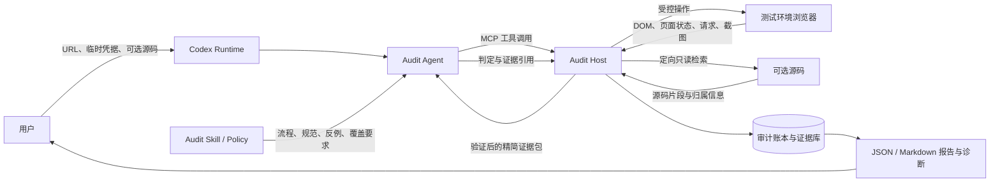
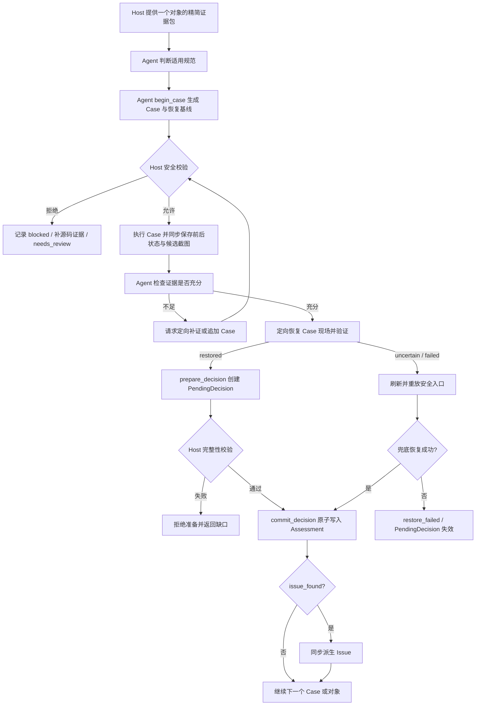
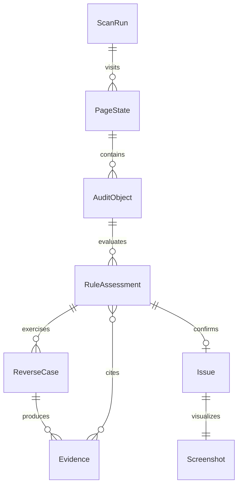

# agent-f 顶层架构

| 元信息 | 内容 |
|---|---|
| 文档版本 | 1.1.0-draft |
| 日期 | 2026-08-30 |
| 状态 | 设计收敛中 |
| Owner | agent-f 维护者 |

架构原则中的系统不变量以 [设计治理与系统不变量](design-governance.md) 为准，领域和算法细节分别见 [领域模型](domain-model-and-lifecycle.md)、[身份与恢复](identity-and-recovery.md)、[动作安全](action-safety-and-credentials.md) 和 [证据完整性](evidence-and-decision-integrity.md)。

## 1. 文档目的

本文档定义 agent-f 第一版的顶层工程架构，承接 [产品契约](product-contract.md)，回答以下问题：

- Codex、Agent、Skill 和 Host 如何协作；
- 谁拥有调查决策权，谁拥有执行和安全控制权；
- 页面、对象、反向 Case、证据、判定和报告如何形成闭环；
- 哪些事实可以信任，哪些输入必须按不可信数据处理；
- 后续 Host–Agent 协议和数据 Schema 应遵守哪些边界。

本文档只确定逻辑职责和系统边界，不提前规定具体类名、函数或物理部署细节。

## 2. 架构目标

agent-f 的架构必须同时满足五个目标：

1. **Agent 自主调查**：由 Agent 选择对象、生成反向 Case、补充证据并完成语义判断；
2. **Host 安全执行**：所有浏览器、源码、网络、截图和持久化操作均由 Host 执行和约束；
3. **证据先于结论**：Agent 只能引用 Host 已验证的对象和证据，不能凭空创建正式问题；
4. **对象级可追溯**：正式问题必须回到真实页面中的待检查对象、适用规范和独立病灶截图；
5. **规范可持续扩展**：当前规则只是第一版注册内容；新增规范不得要求重写核心调查循环、账本或报告协议。

核心原则是：

> Agent 决定查什么和如何理解，Host 决定能否安全执行并保证事实没有被伪造，Skill 决定什么属于规范问题。

## 3. 系统上下文



Codex Runtime 承载 Agent、Skill 和 MCP 调用。Audit Host 是 agent-f 自己实现的本地执行程序，不是第二个 Agent，也不参与业务语义争论。

## 4. 逻辑分层

### 4.1 Codex 运行层

负责：

- 承载大模型 Agent；
- 加载 agent-f Skill；
- 调用 MCP 工具；
- 保持一次扫描中的调查上下文。

第一版只适配 Codex，不抽象跨平台 Agent 协议。

### 4.2 Skill / Policy 知识层

负责维护：

- Agent 审计流程；
- 当前规则注册表中的有效规范；
- 每条规范的适用对象、反向 Case 原则、通过条件、问题条件、反例和覆盖要求；
- Agent 行为边界、输出约束和术语。

`SKILL.md` 只保存总流程和路由规则；每条规范使用独立文件，Agent 只在需要时加载当前对象相关规范。规则文件格式见 [规则契约](rule-contract.md)。

该层不执行浏览器操作，不保存运行事实，也不能绕过 Host 安全策略。

规范数量和具体 ID 不得写死在 Agent 提示、Host 分支、账本 Schema 或报告模板中。Agent 根据当前扫描锁定的规则注册表动态加载与对象相关的规范。

### 4.3 Agent 调查层

Agent 是语义控制面，负责：

- 从 Host 返回的候选中选择待检查对象；
- 对 Host 推荐的规范做实际适用性判断；
- 根据规范和页面上下文生成反向 Case；
- 决定是否需要运行态、源码、请求或视觉补证；
- 在最低覆盖要求内选择 Case 顺序和具体输入；
- 对当前“对象 × 规范”给出固定状态判定；
- 提交扫描覆盖证明和结束理由。

Agent 一次只处理一个对象的精简证据包。完整页面、源码和历史证据不直接塞入模型上下文。

### 4.4 Host 接口层

Host 同时暴露：

- **MCP 接口**：供 Codex Agent 正常运行；
- **CLI 接口**：供开发调试、自动测试和批处理。

MCP 与 CLI 只负责协议适配，必须调用同一套 Host 核心能力，不能形成两套执行逻辑。

### 4.5 Host 执行层

Host 是确定性执行面，由以下逻辑能力组成：

| 能力 | 责任 |
|---|---|
| 任务与会话 | 创建扫描、临时接收凭据、管理浏览器上下文、处理失败和结束 |
| 页面探索 | 导航、识别页面状态、发现可继续探索的安全入口、检测重复与停滞 |
| 对象发现 | 从 DOM、ARIA、可见文本和结构中生成候选对象，并给出可能适用的规范 |
| 动作安全 | 校验 Agent 动作意图，阻断危险动作和潜在写请求 |
| Case 执行与恢复 | 执行受控动作，记录动作前状态和反向动作，优先定向恢复并验证，必要时刷新重放兜底 |
| 运行态取证 | 采集 DOM、可见状态、请求观察、前后状态和对象位置 |
| 源码绑定 | 只围绕当前页面对象查找组件、handler、API 和校验逻辑 |
| 视觉取证 | 在 Case 执行期间保存候选截图，确认问题时输出独立病灶截图 |
| 完整性校验 | 校验对象、规范、证据、截图和判定引用属于同一审计链 |
| 账本与报告 | 保存完整审计记录，生成问题报告、覆盖证明和运行诊断 |

Host 可以拒绝 Agent 请求，但不能自行把候选升级为正式问题。Case、PendingDecision 和正式判定的事务边界见 [领域模型](domain-model-and-lifecycle.md) 与 [证据完整性](evidence-and-decision-integrity.md)。

### 4.6 持久化与输出层

负责保存：

- 扫描元数据和状态；
- 页面与状态遍历记录；
- 正式待检查对象；
- 反向 Case 计划与执行结果；
- 不可变证据记录；
- 对象/规范判定；
- 问题项和截图；
- 覆盖证明、日志和诊断。

主报告只突出 `issue_found`。其他状态保留在主账本和复核区，不得被丢弃。

## 5. 控制权划分

### 5.1 Agent 拥有的控制权

- 选择下一调查对象；
- 判断规范是否实际适用；
- 生成反向 Case；
- 选择需要补充的证据；
- 判断问题、通过、不适用、待复核或噪声；
- 说明覆盖是否充分以及为什么结束探索。

### 5.2 Host 拥有的控制权

- 凭据和浏览器会话；
- 任何真实操作是否允许执行；
- 网络请求是否被阻断；
- 对象和证据是否真实存在；
- 截图是否来自当前对象和页面状态；
- 判定是否引用了合法对象、规范和证据；
- 报告是否满足发布完整性门槛。

### 5.3 不允许覆盖的边界

- Agent 的理由不能覆盖 Host 安全拒绝；
- Host 的类型匹配不能替代 Agent 的语义判断；
- Skill 的说明不能伪造运行事实；
- 源码意图不能覆盖已经观察到的运行态表现；
- 模型置信度不能单独升级为 `issue_found`；
- 没有页面病灶和可靠截图，不能生成正式问题项。

## 6. 核心运行链路

### 6.1 任务初始化

1. 用户提供 URL、临时账号密码、可选源码路径和输出配置；
2. Host 在进程内临时持有凭据并完成登录；
3. 登录失败则任务失败，只输出诊断；
4. 登录成功后立即清除凭据变量，Agent 只收到登录结果和页面元数据；
5. Host 建立扫描 ID、浏览器上下文和初始页面状态。

### 6.2 页面探索与对象发现

1. Host 采集当前页面的 DOM、ARIA、可见文本、路由和可操作入口；
2. Host 根据确定性结构生成候选对象；
3. Agent 可以提出未知封装对象候选；
4. 新候选必须由 Host 重新定位和验证；
5. 只有至少可能适用一条有效规范的对象，才进入正式审计队列；
6. 页面中其他元素只参与覆盖和上下文，不进入主账本。

### 6.3 对象调查循环



每条规范定义自己的最低覆盖维度。Agent 可以选择具体 Case，但未覆盖最低维度时不得输出 `scanned_no_issue`。

### 6.4 Case 恢复

1. Case 开始前，Host 保存恢复基线，只覆盖页面身份和本 Case 可能改变的可观察状态；
2. Host 为实际执行的动作记录动作前状态和反向动作，例如关闭本 Case 打开的弹窗、收起展开行、恢复字段原值和切回原 Tab；
3. Case 结束后，Host 按动作日志逆序执行定向恢复；
4. Host 校验 URL/route、页面层级、Tab、弹窗/抽屉、被修改控件、待检查对象和残留请求等关键基线。动态时间、随机 ID 等无关差异不参与等价判断，也不要求整页 DOM hash 相同；
5. 每次恢复尝试输出 `restored`、`uncertain` 或 `failed`。只有 `restored` 可以继续调查；
6. 定向恢复为 `uncertain` 或 `failed` 时，Host 刷新当前 URL并重放已记录的安全入口；
7. 刷新兜底后仍不能恢复页面状态或可靠重新绑定原逻辑对象时，标记 `restore_failed`，停止当前对象剩余检查；
8. 定向恢复不等于永久持有原 DOM 节点。任何前端重渲染后，Host 都必须重新验证对象运行实例；匹配不唯一时不得猜测；
9. 页面状态污染导致运行中断时，本次扫描的已有问题结论全部作废。

恢复验证是 Host 的确定性职责，Agent 不能用自然语言理由把 `uncertain` 覆盖成 `restored`。恢复基线、反向动作、每次恢复尝试和验证证据都写入 Case 账本。

恢复结果按以下硬条件判定：

- `restored`：所有必检维度均为 `match`，不存在 `unknown`，且没有残留写请求或超时未结束请求；
- `uncertain`：没有已确认的关键差异，但至少一个必检维度无法可靠观察或对象匹配不唯一；
- `failed`：任一关键基线明确不一致、反向动作执行失败、检测到写请求，或对象明确无法恢复。

视觉比较只能补充局部状态验证，不能把结构或对象身份的 `unknown`、`mismatch` 覆盖成 `match`。

### 6.5 扫描结束

1. Agent 检查是否仍有未处理的安全入口、页面状态或待检查对象；
2. Agent 提交覆盖证明和结束理由；
3. Host 校验访问记录、对象处理记录、跳过原因和问题证据完整性；
4. 对象级 `needs_review` 不阻塞完成；
5. 探索停滞经多次重新规划仍无进展时，任务以 `partial` 结束；
6. 浏览器、网络或模型失败导致任务中断时，任务失败，正式问题结论作废。

## 7. 核心数据关系



顶层对象职责：

| 对象 | 含义 |
|---|---|
| `ScanRun` | 一次完整扫描及其状态、输入边界和覆盖证明 |
| `PageState` | 一个可复盘的页面/路由/弹窗/Tab/详情状态 |
| `AuditObject` | 实际出现在页面并进入正式审计的待检查对象 |
| `RuleAssessment` | 一个对象对一条适用规范的审计过程和最终结果 |
| `ReverseCase` | Agent 针对规范生成、由 Host 执行的反向或边界检查 |
| `Evidence` | Host 采集并验证的不可变事实记录 |
| `Issue` | 由 `issue_found` 产生的正式问题项 |
| `Screenshot` | 只属于一个问题项的独立病灶截图 |

精确字段、枚举和引用约束在下一阶段的数据 Schema 中定义。

## 8. 状态模型

### 8.1 扫描状态

```text
created
  → authenticating
  → exploring
  → auditing
  → finalizing
  → completed / partial

任一运行阶段 → failed
```

- `completed`：达到声明范围的完成条件；允许存在对象级 `needs_review`；
- `partial`：探索停滞或部分页面/对象无法完成，但任务正常收束并保留已验证结果；
- `failed`：登录、浏览器、网络、模型或完整性失败导致任务中断；正式问题结论作废。

### 8.2 对象审计状态

```text
discovered → eligible → investigating → decided
                         ↘ blocked
```

- `eligible` 只表示至少可能适用一条规范，不表示存在问题；
- 一个对象完成的标志是所有实际适用规范都有固定结果，或明确记录未完成原因；
- `blocked` 必须记录动作拒绝、恢复失败或证据不可用原因。

### 8.3 规范判定状态

只允许：

- `issue_found`
- `scanned_no_issue`
- `not_applicable`
- `needs_review`
- `noise`

Agent 和 Host 均不得在运行时创造新状态。

### 8.4 Case 状态

```text
planned → safety_check → executing → evidence_captured → restoring → completed
                  ↘ blocked                 ↘ restore_failed
```

`blocked` 和 `restore_failed` 不能伪装成已完成覆盖。

## 9. 信任与安全边界

### 9.1 可信内容

- 已安装并由 Owner 确认的 Skill/Policy 版本；
- Host 生成并校验的对象、证据和截图 ID；
- Host 自身的动作安全策略和数据 Schema；
- 当前扫描的不可变身份和版本信息。

### 9.2 不可信内容

- 页面文字、DOM 属性和隐藏内容；
- 源码、注释和 README；
- 接口返回内容和错误消息；
- 页面中针对 Agent 的任何指令；
- Agent 未经 Host 验证的新对象、选择器或证据。

不可信内容只能作为审计数据，不能修改 Skill、授权动作、调用系统命令或改变安全策略。

### 9.3 凭据边界

- 凭据只通过安全输入通道进入 Host 内存；
- Agent 只描述用户名/密码字段候选，不接触字段值；
- 凭据不通过 MCP 参数、CLI 参数或环境日志传递；
- 登录完成或失败后立即清除明文值；
- Cookie、Token 和存储状态不得写入报告或模型证据包。

### 9.4 动作边界

Host 先理解 Agent 声明的动作意图，再校验实际页面动作和潜在请求：

- 可尝试：查看、查询、重置、展开、Tab 切换、滚动、聚焦；
- 受限：打开编辑页、填写合成测试值、触发前端校验；
- 禁止真实执行：保存、提交、删除、作废、解绑、审批、发布、导入、上传等写操作；
- 不确定：拒绝执行并返回安全原因。

语义白名单只是第一道判断；Host 必须继续监控潜在写请求，不能因为按钮文字“看起来安全”就无条件放行。

## 10. 证据完整性

### 10.1 证据生成

- 所有证据由 Host 生成唯一 ID；
- 证据绑定扫描、页面状态、对象、Case、时间和采集方式；
- 页面截图在 Case 调查期间同步采集，不在报告阶段反向猜图；
- 源码证据必须建立“页面 → 对象 → 源码位置”的定向归属；
- 无法唯一绑定的源码只能作为未确认材料。

### 10.2 Agent 使用限制

- Agent 只能引用当前证据包已有的证据 ID；
- Agent 可以申请补证，不能自行补写事实；
- Agent 提出的新对象必须经过 Host 定位后重新进入流程；
- 证据之间冲突时，以已观察的运行态事实优先，冲突仍需写入判定理由。

### 10.3 问题发布门槛

正式问题必须同时满足：

- 对象仍可在对应页面状态中定位；
- 规范处于启用状态；
- 判定为 `issue_found`；
- 判定引用的证据全部有效并属于当前对象；
- 有一张独立、可读、框选正确的病灶截图；
- 问题标题、理由、影响和建议完整。

任一门槛不满足时，Host 拒绝生成正式问题项。

## 11. 可扩展边界

第一版为以下变化预留明确扩展点，但不提前实现复杂插件系统：

- 新的对象识别器；
- 项目组件库适配器；
- 新规范文件或规范版本；
- React/Vue 等源码绑定适配器；
- 视觉证据采集器；
- 不同报告渲染器；
- 后续断点续跑和人工复核工作流。

扩展不得绕过 Host 的动作安全、证据 ID、Schema 和问题发布门槛。

### 11.1 规则注册与生命周期

Host 在任务启动时加载一个版本化规则注册表，并把本次使用的规则集合、每条规则版本和注册表摘要写入 `ScanRun`。扫描运行期间规则集合冻结，不允许中途热更新。

注册表只描述规则元数据和能力需求，不替 Agent 做语义判断。它至少包含：

- 规则 ID、版本、启用状态和 Owner；
- 可能适用的对象类型；
- 所需 Host 能力，例如 DOM、交互、源码、请求或视觉证据；
- 规范文件位置；
- 默认严重度和允许调整范围；
- 最低覆盖声明；
- 回归样本和验证状态。

规则生命周期为：

```text
draft → owner_approved → validated → enabled → deprecated
```

- 只有 `enabled` 规则进入正式审计；
- `draft` 和 `owner_approved` 可用于试运行，但不能生成正式问题；
- `deprecated` 保留历史 ID 和版本解析能力，不再参与新扫描；
- 规则 ID 永不复用，规则含义发生实质变化时必须提升版本；
- 报告必须记录判定所使用的精确规则版本。

### 11.2 新增规则的接入路径

新增规则分成两类：

1. **现有能力可支持**：增加规范文件、注册信息、对象映射和回归样本即可；
2. **需要新能力**：先为 Host 增加通用采集/执行能力或受控适配器，再由规则声明依赖该能力。

Host 不得为每条规则堆叠独立的顶层执行流程。规则专用逻辑必须位于可注册的识别器、证据采集器或验证器中，并继续输出统一的对象、Case、证据和判定协议。

一条新规则完成接入的客观条件是：

- 不修改固定五种判定状态；
- 不修改主账本的核心关联关系；
- 不修改 Agent 的通用调查循环；
- 通过规则正例、反例、安全和截图回归验证；
- 能在报告中以统一结构展示，并准确记录规则版本。

## 12. 第一版部署形态

```text
Codex
  ├── agent-f Skill
  └── agent-f MCP Server
          └── Host Core (Python)
                 ├── Playwright 浏览器
                 ├── 源码只读分析
                 ├── 安全与证据模块
                 └── 账本与报告

开发/测试
  └── agent-f CLI
          └── 同一 Host Core
```

主语言采用 Python；浏览器内探针可使用少量 JavaScript。只有当 Python 无法可靠处理 JSX、TypeScript 或 Vue SFC 时，再增加独立 TypeScript 源码分析器。

## 13. 下一阶段设计门槛

进入编码前，必须继续完成：

1. 按 [设计验收与追溯](verification-and-traceability.md) 关闭全部阻塞条款；
2. 把协议中的 Bootstrap、Case、PendingDecision 和 Operation 查询落到协议 Schema；
3. 把身份、恢复、安全和证据算法版本写入账本 Schema；
4. 完成 FUA-10 的垂直切片前纸面验收；
5. 运行设计一致性复核并由 Owner 将治理状态更新为 `implementation-ready`。

第一版垂直切片应优先证明：Agent 能通过 Host 安全地调查一个页面对象，生成反向 Case，引用真实证据完成判定，并输出与病灶对位的截图。
