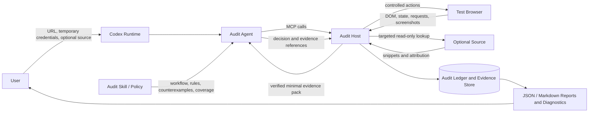
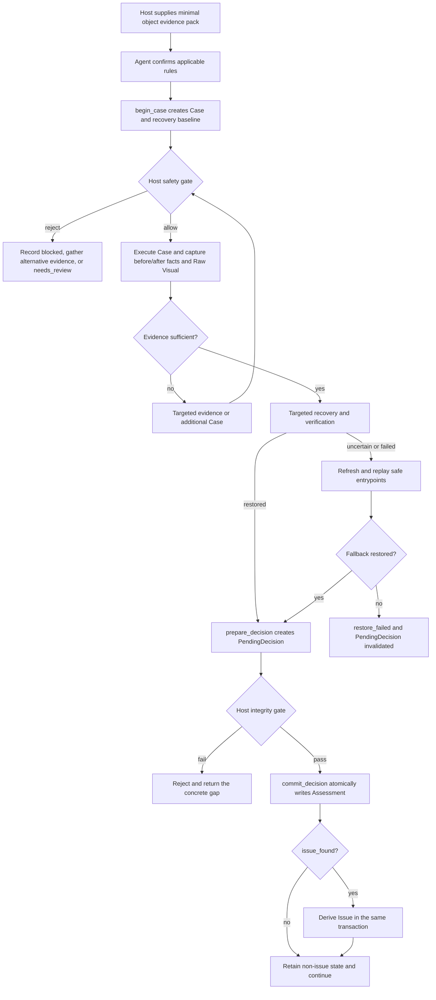
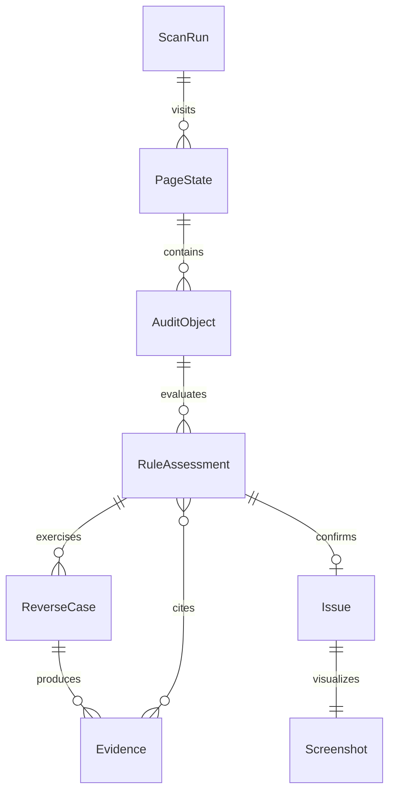

# Assayer Top-Level Architecture

| Metadata | Value |
|---|---|
| Document version | 1.2.0-draft |
| Date | 2026-08-31 |
| Status | Design converging |
| Owner | Assayer Maintainers |

[Design Governance](design-governance.md) owns system invariants. [Domain Model](domain-model-and-lifecycle.md), [Identity and Recovery](identity-and-recovery.md), [Action Safety](action-safety-and-credentials.md), and [Evidence Integrity](evidence-and-decision-integrity.md) own domain and algorithm details.

## 1. Purpose

This document defines the first-version engineering architecture derived from the [Product Contract](product-contract.md). It explains how Codex, Agent, Skill, and Host cooperate; separates semantic authority from execution and safety; closes the page-object-Case-evidence-decision-report chain; defines trust boundaries; and constrains later protocol and schema work. It specifies logical responsibilities and boundaries, not class names, functions, or physical deployment details.

## 2. Architecture Goals

1. **Autonomous Agent investigation**: Agent selects objects, generates reverse Cases, gathers evidence, and makes semantic decisions;
2. **Safe Host execution**: Host controls every browser, source, network, screenshot, and persistence action;
3. **Evidence before conclusions**: formal issues reference Host-verified objects and Evidence;
4. **Object-level traceability**: every issue returns to a runtime object, applicable rule, and independent defect screenshot;
5. **Sustainable rule extension**: new rules do not rewrite the core investigation loop, ledger, or report protocol.

> Agent decides what to inspect and how to interpret it. Host decides whether execution is safe and whether facts are genuine. Skill defines what constitutes a rule issue.

## 3. System Context



Codex Runtime hosts Agent, Skill, and MCP calls. Audit Host is Assayer's local executor, not a second Agent and not a participant in business-semantic debate.

## 4. Logical Layers

### 4.1 Codex Runtime

Hosts the model Agent, loads the Assayer Skill, invokes MCP tools, and retains investigation context for one Scan. The first version targets Codex only and does not abstract a cross-platform Agent protocol.

### 4.2 Skill and Policy Knowledge

Maintains the general audit workflow; enabled registry rules; their applicable objects, reverse-Case principles, pass/issue criteria, counterexamples, and coverage; and Agent behavior/output terminology. `SKILL.md` contains overall flow and routing, while independent rule files are loaded only when relevant. See [Rule Contract](rule-contract.md).

This layer performs no browser action, stores no runtime fact, and cannot bypass Host safety. Rule count and IDs are dynamic registry data, never hard-coded in Agent prompts, Host branches, ledger schemas, or report templates.

### 4.3 Agent Investigation

Agent is the semantic control plane. It selects candidates, confirms actual applicability, plans reverse Cases, requests runtime/source/request/visual evidence, chooses Case order and safe inputs within coverage constraints, produces one fixed result for each object-rule pair, and submits Coverage Proof and stop rationale.

Agent handles one minimal object evidence pack at a time; complete pages, repositories, and evidence history do not enter context. [LLM Investigation Orchestration](llm-agent-orchestration.md) owns multi-turn state, Findings, stall handling, Codex entrypoints, and migration. Agent Runtime is outside Host; Host Core has no model SDK and does not call a model.

### 4.4 Host Interfaces

Host exposes MCP for normal Codex Agent use and CLI for development, automated tests, and batch operation. Both are protocol adapters over the same Host Core.

The implementation includes a static deterministic Harness and a real Chromium Host smoke path for contract, integration, and CI verification. Neither is the Agent investigation layer. Harness explicitly injects fixtures for decision transactions. Real smoke collects browser facts only and creates no Assessment/Issue. Without a real adapter, login, page, identity, action, and recovery fail closed. See [Browser and MCP Integration](browser-mcp-integration-plan.md) and [C01-C07 Plan](llm-agent-integration-plan.md).

### 4.5 Host Execution

| Capability | Responsibility |
|---|---|
| Task and session | Create Scan, receive temporary credentials, manage browser context, failure, and termination |
| Page exploration | Navigate, identify PageStates, discover safe entrypoints, detect repetition and stalls |
| Object discovery | Generate candidates from DOM, ARIA, visible text, and structure; suggest potential rules |
| Action safety | Validate Agent intent and block dangerous actions and potential writes |
| Case execution and recovery | Execute controlled actions, log baseline/inverses, perform targeted recovery and refresh replay |
| Runtime evidence | Collect DOM, visible state, request observations, before/after state, and object location |
| Source binding | Search components, handlers, APIs, and validation only around the current object |
| Visual evidence | Save candidate images during Cases and an independent defect image for confirmed issues |
| Integrity | Validate that object, rule, evidence, screenshot, and decision belong to one audit chain |
| Ledger and reports | Persist complete records and generate issue report, coverage proof, and diagnostics |

Host may reject Agent requests but cannot promote a candidate to an issue by itself. Transaction boundaries are defined by [Domain Model](domain-model-and-lifecycle.md) and [Evidence Integrity](evidence-and-decision-integrity.md).

### 4.6 Persistence and Output

Stores Scan metadata/state, PageState traversal, formal objects, Case plans and execution, immutable Evidence, object-rule decisions, Issues/screenshots, Coverage Proof, logs, and diagnostics. The primary report highlights only `issue_found`; all other results remain in the ledger and review view.

## 5. Authority Separation

Agent owns next-object selection, applicability, reverse-Case design, evidence requests, five-state semantic decisions, coverage sufficiency, and exploration stop rationale.

Host owns credentials/session, whether a real action executes, request blocking, existence of objects and Evidence, screenshot binding, decision-reference validity, and publication-integrity gates.

Neither may cross these boundaries:

- Agent rationale cannot override Host safety rejection;
- Host type matching cannot replace Agent semantic judgment;
- Skill text cannot fabricate runtime facts;
- Source intent cannot override observed runtime behavior;
- Model confidence alone cannot become `issue_found`;
- No formal issue exists without a page defect and reliable screenshot.

## 6. Core Runtime Flow

### 6.1 Initialization

1. User provides URL, temporary credentials, optional source path, and output configuration;
2. Host holds credentials in-process temporarily and signs in;
3. Login failure fails the task with diagnostics only;
4. After success, plaintext is cleared immediately and Agent receives only login result and page metadata;
5. Host creates Scan identity, browser context, and initial PageState.

Alpha currently exposes anonymous URL audits; credential flow remains a later first-version target.

### 6.2 Exploration and Object Discovery

Host collects current DOM, ARIA, visible text, route, and actionable entrypoints and deterministically generates candidates. Agent may propose an unknown wrapped object, but Host must relocate and verify it. Only objects with at least one potentially applicable enabled rule enter formal audit; other elements remain context and coverage facts.

### 6.3 Object Investigation Loop



Each rule defines minimum dimensions. Case choice belongs to Agent, but missing required coverage forbids `scanned_no_issue`. `plannedCoverageDimensions` is intent only; formal coverage comes from per-dimension Findings and Host Evidence.

### 6.4 Case Recovery

Before a Case, Host saves only relevant page identity and potentially changed observable state. Every executed action records pre-state and inverse. Host applies inverses in reverse order and verifies route, layer, tab, overlays, changed controls, object identity, pending requests, and write requests. Dynamic timestamps and random IDs do not affect equivalence; whole-page DOM equality is unnecessary.

Recovery yields only:

- `restored`: every required dimension is `match`, no `unknown`, residual write, or timed-out pending request;
- `uncertain`: no confirmed critical mismatch, but a required dimension is unobservable or object matching is non-unique;
- `failed`: critical mismatch, inverse failure, detected write, or unrecoverable object.

`uncertain` or `failed` triggers refresh of the current URL and replay of recorded safe entrypoints. Continued failure marks `restore_failed` and stops the object. Rerender always invalidates raw DOM references and requires rebinding. Page contamination that interrupts the Scan invalidates existing conclusions. Visual comparison supplements local verification only and cannot override structural or identity `unknown/mismatch`.

### 6.5 Completion

Agent checks unfinished safe entrypoints, PageStates, and objects, then submits coverage and stop rationale. Host validates visits, processing, skip reasons, and issue evidence. Object-level `needs_review` alone does not block completion. Repeated stalled exploration converges to `partial`; fatal browser, network, model, or integrity failure produces `failed` and invalidates formal conclusions.

## 7. Core Data Relationships



| Object | Meaning |
|---|---|
| `ScanRun` | Complete Scan, state, input boundary, and Coverage Proof |
| `PageState` | Replayable page/route/dialog/tab/detail snapshot |
| `AuditObject` | Runtime object admitted to formal audit |
| `RuleAssessment` | Process and result for one applicable object-rule pair |
| `ReverseCase` | Agent-generated reverse or boundary check executed by Host |
| `Evidence` | Immutable Host-collected and verified fact |
| `Issue` | Formal item derived from `issue_found` |
| `Screenshot` | Independent defect screenshot owned by one issue |

Precise fields, enums, and reference constraints belong to JSON Schemas.

## 8. State Model

### 8.1 Scan

```text
created -> authenticating -> exploring -> auditing -> finalizing -> completed / partial
any active state -> failed
```

`completed` meets declared scope and may contain object-level `needs_review`. `partial` converges normally with stalled or unfinished page/object scope and retains verified results. `failed` is an interrupted login/browser/network/model/integrity run whose formal conclusions are invalid.

### 8.2 Object

```text
discovered -> eligible -> investigating -> decided
                         ↘ blocked
```

`eligible` means only potentially applicable rules, not an issue. Completion requires a fixed result for every actually applicable rule or a documented unfinished reason. `blocked` records action rejection, recovery failure, or unavailable evidence.

### 8.3 Rule Result

Only `issue_found`, `scanned_no_issue`, `not_applicable`, `needs_review`, and `noise` are allowed. Agent and Host cannot invent runtime states.

### 8.4 Case

```text
planned -> safety_check -> executing -> evidence_captured -> restoring -> completed
                  ↘ blocked                 ↘ restore_failed
```

`blocked` and `restore_failed` cannot impersonate completed coverage.

## 9. Trust and Safety Boundaries

Trusted material consists of owner-approved installed Skill/Policy versions; Host-generated object, Evidence, and screenshot IDs; Host safety policy and schemas; and immutable Scan identities and versions.

Untrusted material includes page text, DOM attributes, hidden content, source, comments, README, API responses, errors, embedded Agent instructions, and unverified Agent-proposed objects/selectors/Evidence. It is audit data only and cannot modify Skill, authorize actions, invoke system commands, or change policy.

Credentials enter only Host memory through a secure channel. Agent may identify credential-field candidates but never values. Credentials never travel through MCP/CLI arguments or environment logs and are cleared after login success or failure. Cookies, tokens, and storage state never enter reports or model evidence packs.

Host interprets Agent action intent, then validates page action and possible requests. View, query, reset, expand, tab switch, scroll, and focus may be attempted. Opening edit views, entering synthetic values, and triggering frontend validation are restricted. Save, submit, delete, invalidate, unbind, approve, publish, import, upload, and other writes never execute. Uncertainty rejects with a safety reason. Semantic allowlisting is only the first gate; request monitoring still blocks disguised writes.

## 10. Evidence Integrity

Host generates unique Evidence IDs and binds Scan, PageState, Object, Case, time, and collector. Screenshots are captured during the Case, never guessed later. Source Evidence needs directed page -> object -> source attribution; non-unique source remains unverified.

Agent references existing Evidence IDs, may request more Evidence, and cannot add facts. Proposed objects re-enter Host verification. Observed runtime facts take priority over source intent, while conflicts remain recorded.

A formal Issue requires a still-locatable object, enabled rule, `issue_found`, valid same-object Evidence, an independent readable and correctly marked defect screenshot, and complete title, rationale, impact, and recommendation. Host rejects the Issue if any gate fails.

## 11. Extension Boundaries

Explicit extension points include object recognizers, component-library adapters, rule files/versions, React/Vue source-binding adapters, visual collectors, report renderers, and later resume or human-review workflows. Extensions cannot bypass action safety, Evidence IDs, schemas, or publication gates.

### 11.1 Rule Registry and Lifecycle

At task start Host loads and freezes a versioned registry, writing its rule set, versions, and digest to `ScanRun`. Registry metadata includes ID, version, state, owner, potential object types, Host capabilities, rule path, severity bounds, minimum coverage, regression samples, and validation state. It does not make Agent semantic decisions.

```text
draft -> owner_approved -> validated -> enabled -> deprecated
```

Only `enabled` enters formal audit. Draft and approved rules may trial but cannot create formal issues. Deprecated rules retain historical parsing but do not enter new Scans. IDs are never reused, material semantic change increments version, and reports record exact versions.

### 11.2 New-Rule Onboarding

When existing capabilities suffice, add rule file, registry entry, object mapping, and regression samples. When capabilities are missing, add a general Host collector/executor or controlled adapter first, then declare the dependency. Never accumulate one top-level Host flow per rule; specialized behavior belongs in registered recognizers, collectors, or validators and still emits the unified Object/Case/Evidence/decision protocol.

A new rule qualifies when it changes none of the five results, core ledger relations, or general Agent loop; passes positive, negative, safety, and screenshot regressions; and displays through the unified report with exact version.

## 12. First-Version Deployment

```text
Codex
  |-- Assayer Skill
  `-- Assayer MCP Server
        `-- Host Core (Python)
              |-- Playwright browser
              |-- Read-only source analysis
              |-- Safety and evidence modules
              `-- Ledger and reports

Development and test
  `-- Assayer CLI
        `-- Same Host Core
```

Python is the primary language; browser probes may use limited JavaScript. Add a TypeScript source analyzer only if Python cannot reliably process JSX, TypeScript, or Vue SFC.

## 13. Next Design Gate

Before coding, close all blockers in [Verification and Traceability](verification-and-traceability.md), map Bootstrap/Case/PendingDecision/Operation lookup into protocol schemas, store identity/recovery/safety/evidence algorithm versions in ledger schemas, complete pre-slice FUA-10 paper acceptance, and have the owner mark governance `implementation-ready` after consistency review.

The first vertical slice should prove that Agent safely investigates one page object through Host, generates a reverse Case, decides from genuine Evidence, and outputs a correctly aligned defect screenshot.

## 14. Platformization Boundary

The browser audit described above is the first vertical implementation, not the platform's universal domain model. The domain-neutral laws are defined in [Platform Constitution v1](platform-constitution-v1.md), with detailed plugin, provider, and result surfaces indexed by the [Platform Contract](platform-contract.md). The current module ownership and extraction plan are recorded in [Platform Boundary Map](platform-boundary-map.md).

Platform code must use generic WorkItems, Checks, InvestigationPackets, and runtime adapters. Browser concepts such as PageState, Tab, DOM, and Chromium remain inside the frontend runtime/plugin. A plugin may declare stricter evidence, ordering, batching, caching, or recovery requirements; the Host must honor those constraints and fall back to a slower path when necessary.
