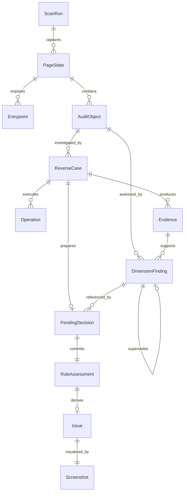
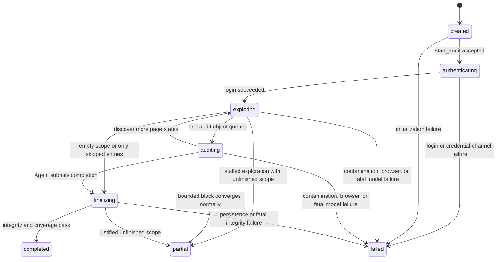

# Assayer Domain Model and Lifecycle

| Metadata | Value |
|---|---|
| Document version | 1.1.0-draft |
| Date | 2026-08-31 |
| Status | Design converging |
| Owner | Assayer Maintainers |

## 1. Purpose

This document is the sole semantic source for the lifecycles of Scan, PageState, Entrypoint, PageCandidate, AuditObject, Operation, ReverseCase, DimensionFinding, PendingDecision, RuleAssessment, and Issue. JSON Schemas own field structure; the Host-Agent protocol owns messages. C02 implements the DimensionFinding schema and tools; this version freezes its domain semantics first.

## 2. Aggregate and Ownership



- `ScanRun` is the consistency aggregate root; every entity belongs to one `scanId`;
- Coverage Proof Entrypoints must exist in the aggregate ledger and agree with processed/skipped/unprocessed classification;
- Host increments `runRevision` when runtime facts successfully change; reads and fully duplicate idempotent requests do not increment it;
- `PageState`, Evidence, Screenshot, RuleAssessment, and Issue are immutable once persisted;
- AuditObject and ReverseCase update through new events or state transitions, never by overwriting historical evidence;
- PendingDecision is temporary and cannot appear in the final formal issue report.

### 2.1 DimensionFinding Semantics

`DimensionFinding` is the Agent's public structured judgment for one `AuditObject x FrozenRule x coverageDimension`, based on Host Evidence. It is neither hidden model reasoning nor the final RuleAssessment.

- State is one of `satisfied`, `violated`, `unresolved`, `blocked`, or `conflicted`;
- It references the Object, Rule, at least one Evidence, and related Case in the same Scan;
- Once written it is immutable; changed judgment creates a new Finding with `supersedesRef` to the previous Finding for the same object, rule, and dimension;
- Superseded Findings remain in the ledger but do not contribute to current progress or coverage;
- A Finding whose Case is not `restored` is staged; after Case `restore_failed` or `invalidated`, it remains historical but is invalid for formal coverage;
- Only `satisfied` and `violated` are resolved; all other states are unresolved;
- `prepare_decision` may reference only the latest valid Finding for each required dimension;
- Rationale is a concise auditable explanation, never hidden chain-of-thought.

## 3. ScanRun State Machine



| Terminal state | Conclusion validity |
|---|---|
| `completed` | `conclusionsValid=true`; formal issues may be published. |
| `partial` | Only recovery-passed, closed-reference decisions remain valid; unfinished scope is disclosed. |
| `failed` | `conclusionsValid=false`; issues remain diagnostic only and cannot be published. |

Non-terminal states cannot set `endedAt`, `terminalReason`, or final Coverage Proof. Login failure, a sent unknown write, unexcluded credential leakage, ledger corruption, or browser contamination must enter `failed`, never `partial`.

## 4. AuditObject State Machine

```text
discovered -> eligible -> investigating -> decided
discovered -> rejected
eligible -> blocked
investigating -> blocked
```

`rejected` candidates appear only in exploration diagnostics, not formal objects. A `blocked` object records unfinished rules and whether Scan `partial` is affected.

## 5. Operation Lifecycle

```text
accepted -> running -> succeeded
                    ↘ rejected
                    ↘ failed_known
                    ↘ result_unknown
```

- Every Host tool request except `get_operation` creates one Operation; reads use `operationKind=read` and do not increment `runRevision`;
- `operationKind` is one of `bootstrap`, `read`, `browser_action`, `recovery`, `decision_preparation`, `decision_commit`, or `lifecycle`;
- Only Operations that successfully change browser or ledger facts increment `runRevision`, at most once;
- Same idempotency key and request digest return the same Operation; a different digest returns `IDEMPOTENCY_CONFLICT`;
- On `result_unknown`, Agent must query with `get_operation` and cannot replay the action;
- When Host proves an action did not occur, it may converge to `failed_known`; otherwise Case enters recovery.

## 6. ReverseCase Lifecycle

```text
planned -> safety_check -> executing -> evidence_captured -> restoring -> completed
                 ↘ blocked                    ↘ restore_failed
planned -> invalidated
executing -> invalidated
```

Hard rules:

- `begin_case` atomically creates Case, freezes object/rule references, and saves the recovery baseline;
- Every Case action references `caseId`;
- `prepare_decision` accepts only a completed Case with `recovery.finalStatus=restored`, creates PendingDecision, and never creates formal Assessment or Issue;
- `commit_decision` accepts only a Case that is `completed` and restored;
- `restore_failed` invalidates PendingDecision and stops the object; unexcluded contamination fails the Scan;
- An `observation` Case may make no page changes but still runs a `noop` recovery check for object and pending-request state.

## 7. PendingDecision Lifecycle

```text
prepared -> commit_ready -> committed
          ↘ rejected
          ↘ invalidated
```

| State | Condition |
|---|---|
| `prepared` | Agent submitted semantic fields; Host validated references and local gates. |
| `commit_ready` | All referenced Cases are `completed/restored`, object still binds, screenshot and Evidence remain valid. |
| `committed` | Host atomically wrote RuleAssessment and, for `issue_found`, Issue. |
| `rejected` | Field, coverage, reference, rule-state, or screenshot gate failed; caller may correct and prepare again. |
| `invalidated` | Recovery failure, revision overrun, identity loss, or Scan failure. |

PendingDecision can be read from SQLite after Host restart but never enters the final ledger; diagnostics retain only ID, state, and sanitized reason. It references final `findingRefs`; planned dimensions only detect out-of-plan findings and never prove coverage.

## 8. RuleAssessment and Issue

RuleAssessment has exactly five results: `issue_found`, `scanned_no_issue`, `not_applicable`, `needs_review`, and `noise`. Every result has a rationale and at least one observation or investigation Case; only applicable rules require their minimum dimensions.

| Result | Required conditions |
|---|---|
| `issue_found` | Applicable, valid Evidence, issue coverage gate, independent IssueScreenshot, all Cases restored. |
| `scanned_no_issue` | Applicable, every minimum dimension complete, all Cases restored, no contrary Evidence. |
| `not_applicable` | Sufficient applicability facts; no capability or inspection gap disguised. |
| `needs_review` | Concrete blocker recorded; incomplete coverage allowed. |
| `noise` | Candidate is genuinely related but confirmed outside rule semantics; record rationale. |

Issue is a one-to-one immutable projection of an `issue_found` Assessment, derived by Host in the same transaction. Title, message, impact, recommendation, and severity come from the Agent PendingDecision; Host adds only IDs, timestamps, and references.

Formal coverage uses final Findings: all required dimensions for `scanned_no_issue` must be `satisfied`; `issue_found` must meet the registry's declared Finding combination; unresolved state permits only `needs_review`. The generic registry contract interprets combinations; the Host main loop never branches on rule ID.

## 9. Legal-Transition Validation

- Protocol validates that a tool is allowed in the current state before calling Host Core;
- Host Core revalidates state, `runRevision`, and references in the same transaction;
- JSON Schema validates local state structure;
- Semantic validation checks that historical events derive the current state;
- Illegal transitions return `INVALID_LIFECYCLE_TRANSITION`; direct field edits cannot repair them.
