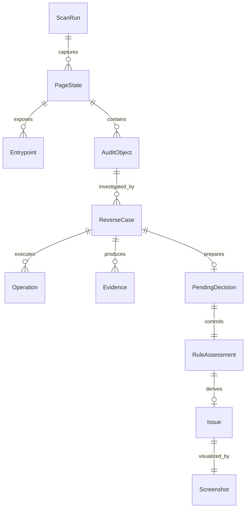
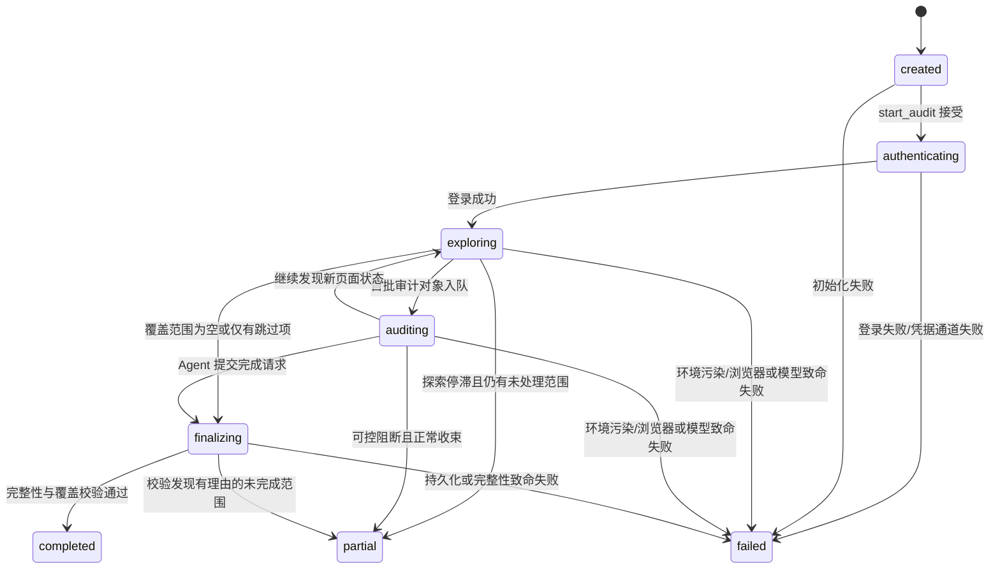
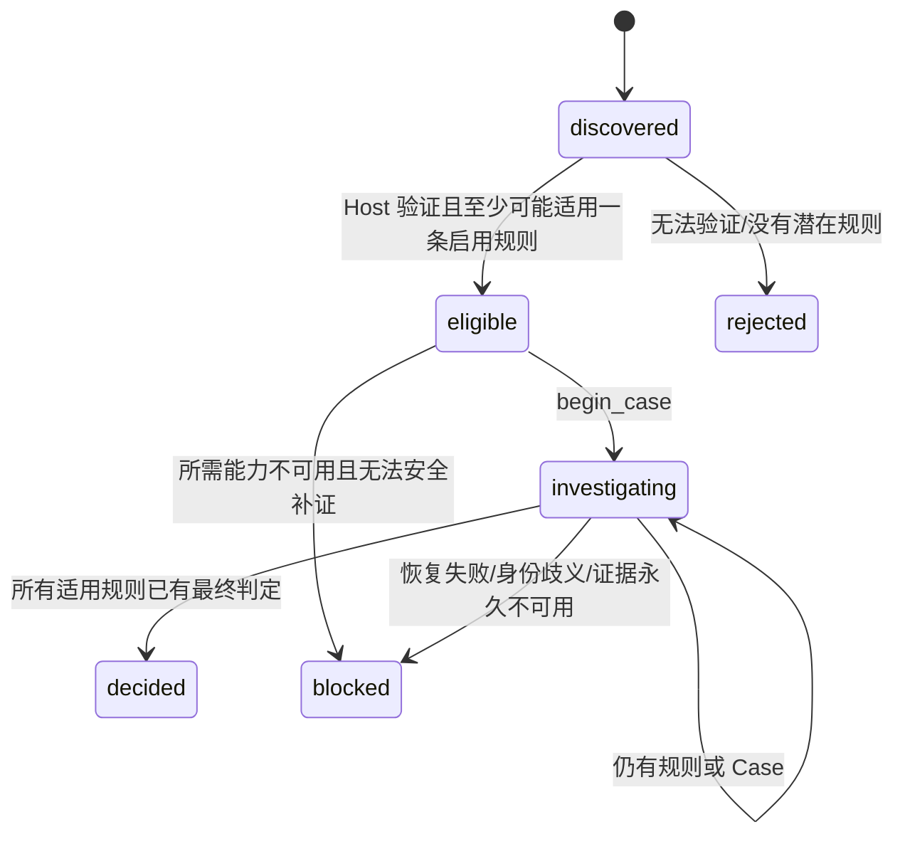
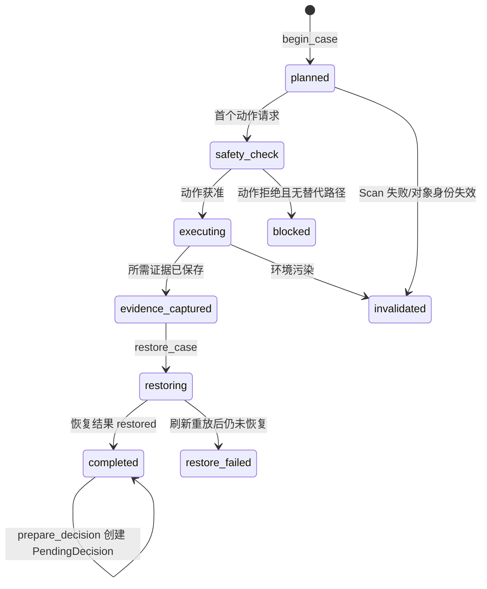

# agent-f 领域模型与生命周期

| 元信息 | 内容 |
|---|---|
| 文档版本 | 1.0.0-draft |
| 日期 | 2026-08-30 |
| 状态 | 设计收敛中 |
| Owner | agent-f 维护者 |

## 1. 目的

本文档是 Scan、PageState、Entrypoint、PageCandidate、AuditObject、Operation、ReverseCase、PendingDecision、RuleAssessment 和 Issue 生命周期的唯一语义来源。字段结构由 JSON Schema 拥有，消息由 Host–Agent 协议拥有。

## 2. 聚合与所有权



- `ScanRun` 是一致性聚合根；所有实体必须属于同一 `scanId`；
- Coverage Proof 引用的 Entrypoint 必须存在于聚合账本中，状态与 processed/skipped/unprocessed 分类一致；
- `runRevision` 由 Host 在运行事实成功改变时递增；读取请求和完全重复的幂等请求不递增；
- `PageState`、Evidence、Screenshot、RuleAssessment 和 Issue 一经持久化即不可变；
- AuditObject 和 ReverseCase 通过新增事件或状态迁移更新，不覆盖历史证据；
- PendingDecision 是临时实体，不能出现在最终正式问题报告中。

## 3. ScanRun 状态机



| 终态 | 结论有效性 |
|---|---|
| `completed` | `conclusionsValid=true`；所有正式问题可发布。 |
| `partial` | 仅已越过恢复屏障且引用链完整的判定有效；未处理范围必须披露。 |
| `failed` | `conclusionsValid=false`；问题只能保留为诊断材料，不得作为正式结论发布。 |

非终态不得设置 `endedAt`、`terminalReason` 或最终覆盖证明。登录失败、检测到已发送的未知写请求、无法排除凭据泄露、账本持久化损坏或浏览器状态污染时必须进入 `failed`，不能降级为 `partial`。

## 4. AuditObject 状态机



`rejected` 候选只进入探索诊断，不进入正式对象数组。`blocked` 对象必须说明尚未完成的规则以及是否影响 Scan 的 `partial` 判定。

## 5. Operation 生命周期

```text
accepted → running → succeeded
                   ↘ rejected
                   ↘ failed_known
                   ↘ result_unknown
```

- 除 `get_operation` 外，每个 Host 工具请求都创建一条 Operation；读取类请求也要记录，但其 `operationKind=read` 且不递增 `runRevision`；
- Operation 必须声明 `operationKind`：`bootstrap`、`read`、`browser_action`、`recovery`、`decision_preparation`、`decision_commit` 或 `lifecycle`；
- 只有成功改变浏览器或账本事实的 Operation 才递增 `runRevision`，一次 Operation 最多递增一次；被拒绝、完全重复幂等请求和纯读取不递增；
- 相同 `idempotencyKey` 和相同请求摘要返回同一 Operation；
- 相同键但请求摘要不同，返回 `IDEMPOTENCY_CONFLICT`；
- `result_unknown` 时不得重放动作，Agent 使用 `get_operation` 查询；
- Host 能确认动作未发生时可将 Operation 收束为 `failed_known`；无法确认时 Case 进入恢复流程。

## 6. ReverseCase 生命周期



硬规则：

- `begin_case` 原子创建 Case、冻结对象/规则引用和恢复基线；
- Case 内每个动作必须引用 `caseId`；
- `prepare_decision` 只接受已完成且 `recovery.finalStatus=restored` 的 Case，创建 PendingDecision，不创建正式 Assessment 或 Issue；
- `commit_decision` 只接受状态为 `completed` 且恢复为 `restored` 的 Case；
- `restore_failed` 时 PendingDecision 失效，当前对象停止；若无法排除环境污染，Scan 失败；
- `observation` Case 允许零页面变更，但仍需执行 `noop` 恢复检查以确认对象和 pending request 状态。

## 7. PendingDecision 生命周期

```text
prepared → commit_ready → committed
         ↘ rejected
         ↘ invalidated
```

| 状态 | 条件 |
|---|---|
| `prepared` | Agent 已提交完整语义字段，Host 已验证引用和局部门禁。 |
| `commit_ready` | 所有引用 Case 已 `completed/restored`，对象仍可绑定，截图和证据仍有效。 |
| `committed` | Host 原子写入 RuleAssessment；`issue_found` 同时写入 Issue。 |
| `rejected` | 字段、覆盖、引用、规则状态或截图门禁不满足，可修正后重新准备。 |
| `invalidated` | Case 恢复失败、运行 revision 越界、对象身份失效或 Scan 失败。 |

PendingDecision 可在 Host 重启后从 SQLite 恢复读取，但不进入最终账本；诊断日志只记录其 ID、状态和非敏感原因。

## 8. RuleAssessment 与 Issue

RuleAssessment 的五种结果固定为：

- `issue_found`
- `scanned_no_issue`
- `not_applicable`
- `needs_review`
- `noise`

所有结果都必须有理由，也必须引用至少一个 observation 或 investigation Case；只有适用规则需要满足规则定义的最低覆盖维度。第一版约束如下：

| 结果 | 必要条件 |
|---|---|
| `issue_found` | applicable、至少一条有效 Evidence、覆盖满足规则的问题确认门槛、独立 IssueScreenshot、所有引用 Case restored。 |
| `scanned_no_issue` | applicable、规则最低覆盖全部完成、所有引用 Case restored、没有相反证据。 |
| `not_applicable` | 适用性事实充分；不得伪装能力不足或未检查。 |
| `needs_review` | 记录具体 blocker；允许覆盖不完整。 |
| `noise` | 候选匹配真实但确认不属于规则问题，记录噪声理由。 |

Issue 与 `issue_found` Assessment 一对一，由 Host 在同一事务内派生。Issue 的标题、消息、影响、建议和严重度必须来自 Agent 已提交的 PendingDecision；Host 只生成 ID、时间和引用，不补写语义。

## 9. 合法转移校验

- 协议层在调用 Host Core 前校验工具是否允许出现在当前状态；
- Host Core 在同一事务内再次校验当前状态、`runRevision` 和引用；
- JSON Schema 校验状态字段的局部结构；
- 语义校验器校验历史事件能否推导出当前状态；
- 非法转移返回 `INVALID_LIFECYCLE_TRANSITION`，不得通过直接写字段修复。
